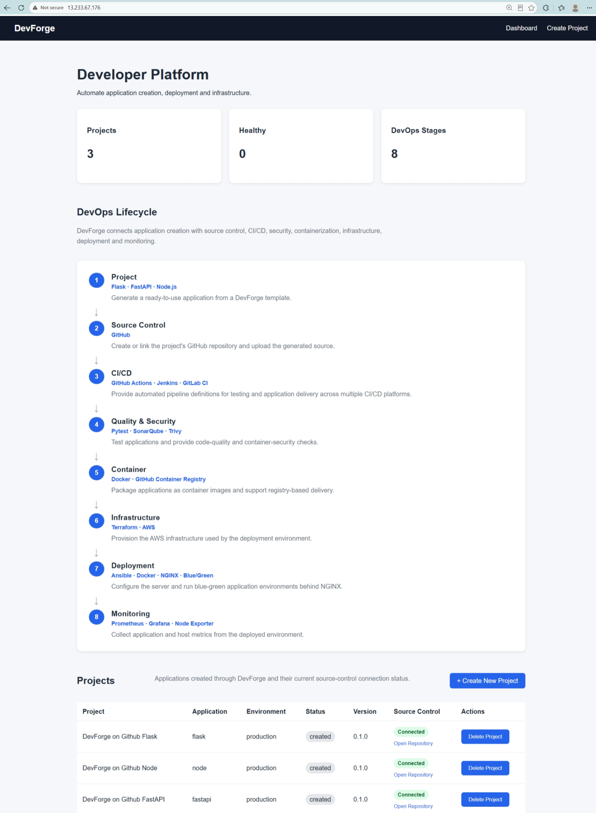
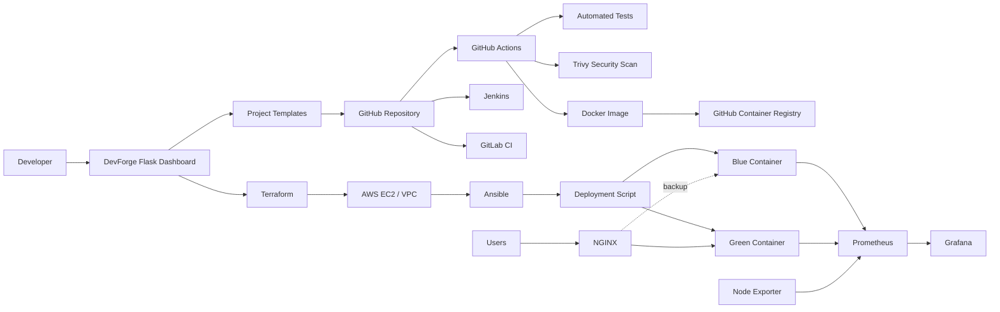
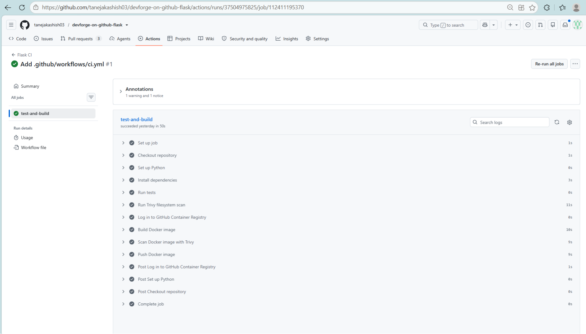
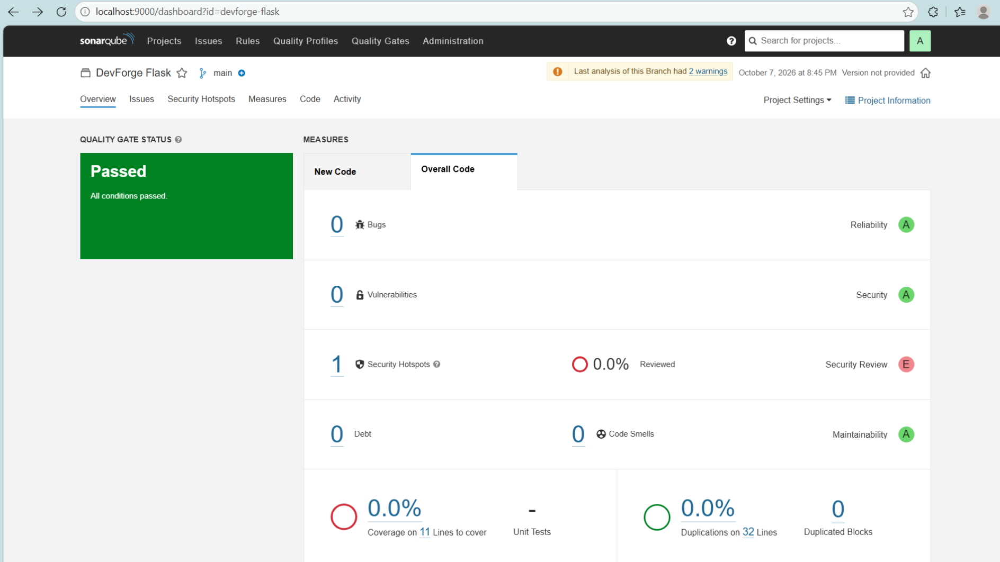
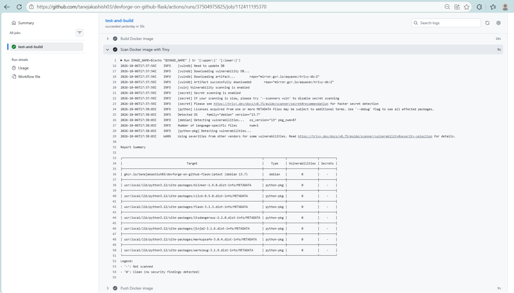
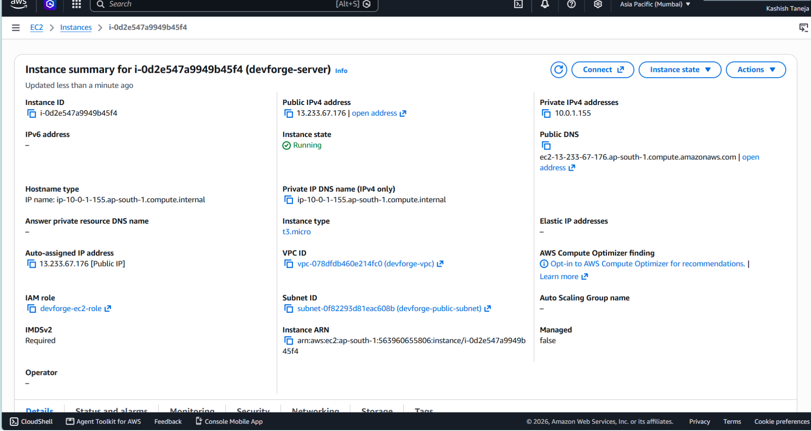
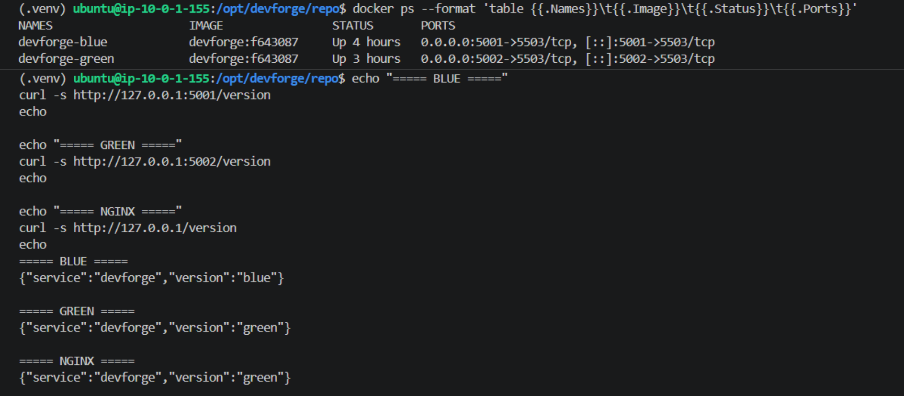
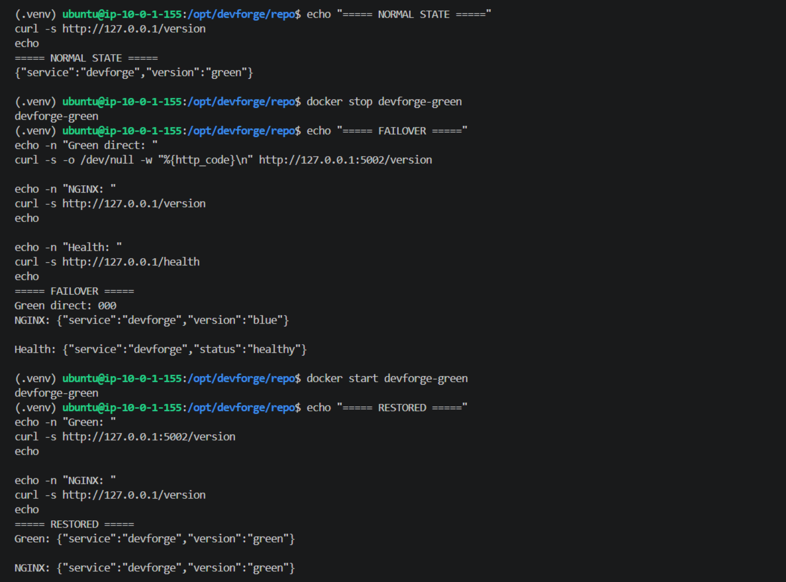
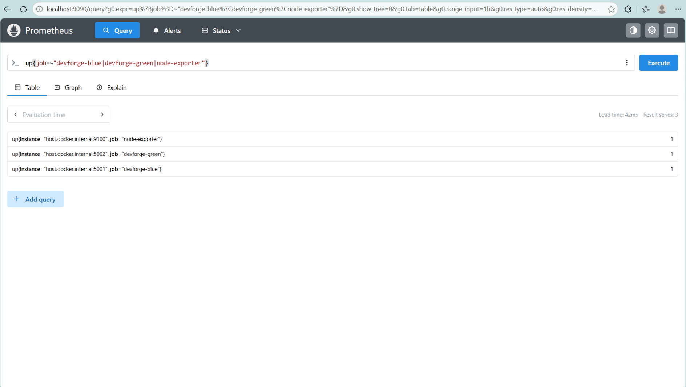
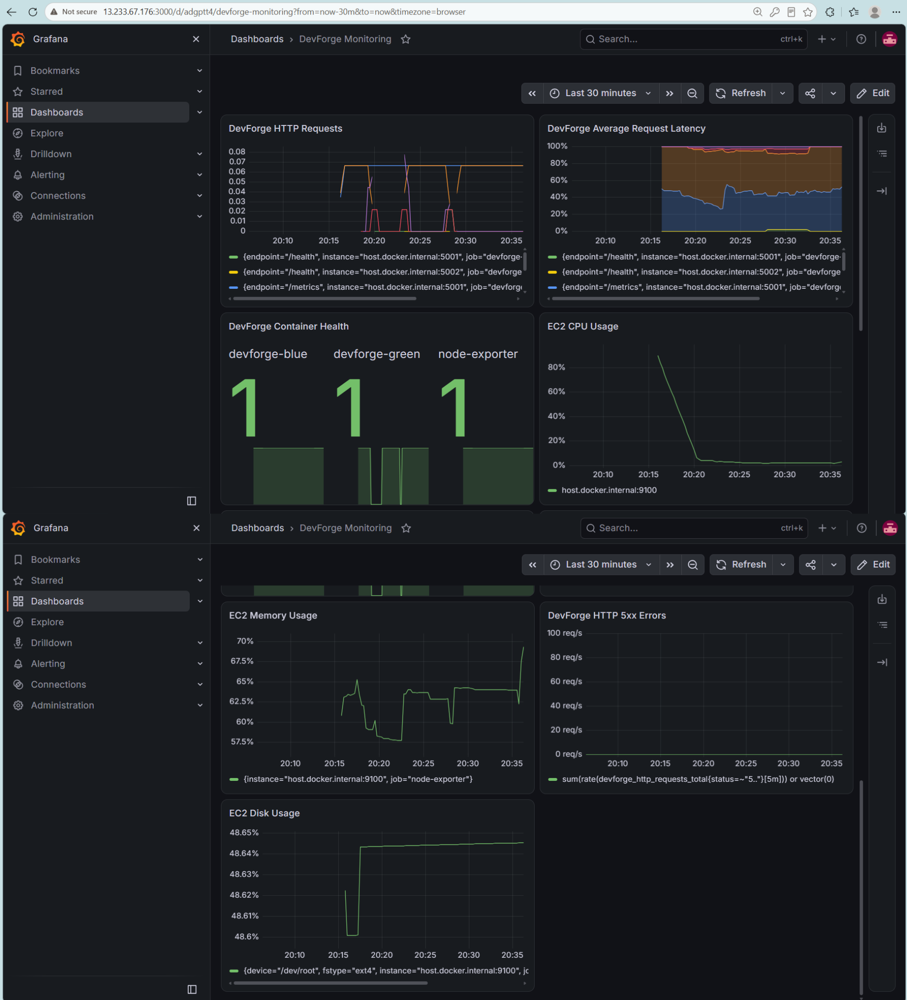

# DevForge

[](https://github.com/tanejakashish03/devforge/actions/workflows/ci.yml)

**DevForge is an integrated DevOps portfolio platform that demonstrates the software delivery lifecycle from project creation to CI/CD, security, containerization, AWS infrastructure, deployment, blue-green failover, and monitoring.**

It combines a Flask-based project generator with GitHub automation and a complete DevOps deployment workflow.

---

## Overview

DevForge lets a user create a new application project from a supported template and publish it directly to GitHub.

Supported project types:

* Flask
* FastAPI
* Node.js

Generated projects include development files, automated tests, CI/CD definitions, containerization, security scanning, dependency management, and deployment-oriented configuration.

The DevForge platform itself is also deployed as a containerized application on AWS using Terraform, Ansible, Docker, NGINX, blue-green deployment, Prometheus, and Grafana.

The overall lifecycle is:

```text
Project Creation
      ↓
GitHub Repository
      ↓
CI/CD
      ↓
Testing + Security + Quality
      ↓
Docker Image → GitHub Container Registry
      ↓
Terraform / AWS
      ↓
Ansible Configuration
      ↓
Docker Deployment
      ↓
NGINX Blue-Green Routing
      ↓
Prometheus + Grafana Monitoring

```

> GHCR publishing applies to generated projects. The DevForge instance on EC2 is built directly from a Git checkout by the deployment script (see [NGINX and Blue-Green Deployment](#nginx-and-blue-green-deployment)).

---

## Dashboard

The DevForge dashboard provides the central view of generated projects and their DevOps lifecycle.



---

## Architecture



---

## Features

### Project Generation

DevForge supports three project templates:

| Template | Technology       | Testing        |
| -------- | ---------------- | -------------- |
| Flask    | Python + Flask   | Pytest         |
| FastAPI  | Python + FastAPI | Pytest + HTTPX |
| Node.js  | Node.js          | npm test       |

Generated projects include relevant files such as:

* Application source code
* Tests
* `Dockerfile`
* `.dockerignore`
* `.trivyignore`
* Dependabot configuration
* GitHub Actions workflow
* Jenkinsfile
* GitLab CI configuration
* SonarQube configuration
* Project README
* Python development dependencies where applicable

### GitHub Integration

DevForge can:

1. Create a GitHub repository.
2. Upload the generated project files.
3. Upload the CI configuration last, so CI does not start against an incomplete repository.
4. Delete a generated project.
5. Remove the associated GHCR package during deletion when the required classic package token is configured.

GitHub integration is implemented through the application service layer.

---

## CI/CD

### GitHub Actions

Generated projects contain GitHub Actions workflows covering:

```text
Checkout
   ↓
Install Dependencies
   ↓
Run Tests
   ↓
Trivy Filesystem Scan
   ↓
Docker Build
   ↓
Trivy Image Scan
   ↓
GHCR Login
   ↓
GHCR Push

```

GHCR publishing is restricted to pushes to the repository's default branch.

The generated GitHub Actions workflows for Flask, FastAPI, and Node.js were tested end-to-end through freshly generated repositories.

The DevForge root repository also has its own CI workflow that runs the project's test suite.



### Jenkins

The generated Flask, FastAPI, and Node.js projects include Jenkins pipelines.

* Python projects install `requirements-dev.txt` before running Pytest.
* Node.js projects use `npm ci` and `npm test`.

The Jenkins definitions have been inspected and validated structurally.

> Jenkins runtime execution was not performed because a Jenkins server was not installed.

### GitLab CI

The generated projects also include GitLab CI definitions.

* Python projects install `requirements-dev.txt`.
* Node.js projects use `npm ci` and `npm test`.

The GitLab CI definitions have been inspected and validated structurally.

> GitLab Runner runtime execution was not performed because GitLab Runner was not installed.

---

## Quality and Security

### SonarQube

SonarQube was used to perform static analysis against the generated Flask template. The scan was executed successfully using a temporary local SonarQube instance.

The SonarQube setup is intentionally separate from the GitHub Actions workflow.



### Trivy

Generated projects contain Trivy-based security scanning for:

1. Project filesystem dependencies.
2. The resulting Docker image.

This provides security checks both before and after containerization.



### Dependabot

Dependabot is configured for:

* Python dependencies
* GitHub Actions dependencies

The root repository also contains Dependabot configuration.

---

## Docker and GitHub Container Registry

DevForge and its generated projects are containerized with Docker.

The generated GitHub Actions workflow:

1. Builds the Docker image.
2. Runs a Trivy image scan.
3. Logs into GHCR when publishing is allowed.
4. Pushes the image to GitHub Container Registry.

The GHCR integration was verified using a generated Flask project, including successful image publication and manifest accessibility.

---

## Terraform and AWS

Terraform provisions the AWS infrastructure used by the DevForge deployment:

* VPC
* Internet Gateway
* Public subnet
* Route table
* Security group
* EC2 instance
* SSH key pair
* IAM role
* IAM instance profile

Network design:

```text
VPC:    10.0.0.0/16
Subnet: 10.0.1.0/24

```

The EC2 instance uses Ubuntu 24.04 with a 20 GB gp3 root volume.

The security group allows:

* HTTP
* HTTPS
* SSH from the configured SSH CIDR
* Outbound traffic

Terraform formatting and validation were verified successfully.

Infrastructure is provisioned once and separately from application deployment. Application updates do not re-run Terraform.



---

## Ansible

Ansible configures the EC2 server. The playbook handles:

* Installing Docker, NGINX, Git, and curl
* Starting and enabling Docker and NGINX
* Creating `/opt/devforge`, the deployment user, and the persistent data directory
* Creating the environment file when the required GitHub token is available
* Fetching the DevForge repository and running the deployment script
* Installing, validating, and reloading the NGINX configuration

The playbook YAML and structure were validated, and the resulting deployment state was independently verified on the EC2 server.

A complete Ansible replay against the production instance was intentionally not performed after the deployment was already working, to avoid unnecessary disruption.

---

## NGINX and Blue-Green Deployment

DevForge runs two application containers:

| Instance | Host Port | Container Port | Role     |
| -------- | --------- | -------------- | -------- |
| Green    | `5002`    | `5503`         | Active   |
| Blue     | `5001`    | `5503`         | Fallback |

NGINX routes normal traffic to Green and keeps Blue as the backup instance.

The deployment script:

1. Fetches the latest code.
2. Resets the deployment checkout to the selected branch.
3. Builds a new Docker image tagged with the Git commit.
4. Deploys Green.
5. Performs a health check.
6. Deploys Blue.
7. Leaves Blue available as the fallback.

If the Green health check fails, the deployment script stops before replacing Blue, so the existing Blue instance remains available to serve traffic.

This is intentionally a lightweight **Green-first blue-green deployment with Blue retained as the fallback instance**, rather than a full production deployment controller.



### Failover

NGINX is configured with Green as the primary upstream and Blue as the backup. If Green becomes unavailable, NGINX falls back to Blue.



---

## Monitoring

DevForge exposes application metrics at `/metrics`.

The monitoring stack consists of:

* Prometheus
* Grafana
* Node Exporter

Prometheus scrapes DevForge Blue, DevForge Green, and Node Exporter.

### Prometheus

Prometheus was verified with all three configured targets reporting as healthy:

```text
devforge-blue
devforge-green
node-exporter

```



### Grafana

A Grafana dashboard is included in the repository as an exported dashboard definition. It provides visibility into DevForge application and infrastructure metrics.



---

## Application Endpoints

| Endpoint           | Purpose                               |
| ------------------ | ------------------------------------- |
| `/`                | DevForge dashboard                    |
| `/health`          | Application health check              |
| `/version`         | Current blue/green deployment version |
| `/metrics`         | Prometheus metrics                    |
| `/projects/create` | Project creation interface            |

The `/version` endpoint is useful for demonstrating which blue/green instance is serving traffic.

---

## Running Locally

### Prerequisites

* Python 3.12+
* Git
* A GitHub account
* A GitHub token with the permissions required by the application

### Setup

```bash
git clone https://github.com/tanejakashish03/devforge.git
cd devforge

```

Create a virtual environment.

**Windows (Git Bash)**

```bash
python -m venv .venv
source .venv/Scripts/activate

```

**Windows (Command Prompt)**

```cmd
python -m venv .venv
.venv\Scripts\activate

```

**Linux / macOS**

```bash
python3 -m venv .venv
source .venv/bin/activate

```

Install dependencies:

```bash
pip install -r requirements.txt

```

Create the local environment file (`copy .env.example .env` on Command Prompt):

```bash
cp .env.example .env

```

Edit `.env` and provide the required values:

```text
FLASK_ENV=development
FLASK_DEBUG=true
DEVFORGE_VERSION=0.1.0
GITHUB_TOKEN=<your GitHub token>
GITHUB_USERNAME=<your GitHub username>
PACKAGES_TOKEN=

```

* `GITHUB_TOKEN` is required for GitHub repository operations.
* `PACKAGES_TOKEN` is optional for local development. It is used for GHCR package cleanup when deleting generated projects and requires classic GitHub package permissions.

> Never commit `.env` or real credentials to Git.

Start DevForge:

```bash
python run.py

```

The application listens on `http://127.0.0.1:5503`.

---

## Testing

```bash
python -m pytest -q

```

The repository's CI workflow runs the same test suite automatically.

---

## Acceptance / Verification

| Area                       | Verification                                                  |
| -------------------------- | ------------------------------------------------------------- |
| Flask project generation   | ✅ End-to-end tested                                           |
| FastAPI project generation | ✅ End-to-end tested                                           |
| Node.js project generation | ✅ End-to-end tested                                           |
| GitHub repository creation | ✅ Verified                                                    |
| Generated GitHub Actions   | ✅ Runtime-tested                                              |
| Jenkins definitions        | ✅ Structurally validated                                      |
| GitLab CI definitions      | ✅ Structurally validated                                      |
| Trivy filesystem scan      | ✅ Verified                                                    |
| Trivy image scan           | ✅ Verified                                                    |
| GHCR publishing            | ✅ Verified                                                    |
| GHCR cleanup               | ✅ Verified                                                    |
| SonarQube analysis         | ✅ Successfully scanned                                        |
| Terraform                  | ✅ `fmt` and `validate` verified                               |
| Ansible                    | ✅ YAML/structure validated; deployment independently verified |
| NGINX                      | ✅ Verified                                                    |
| Blue-green deployment      | ✅ Verified                                                    |
| Failover                   | ✅ Demonstrated                                                |
| Prometheus                 | ✅ Verified                                                    |
| Grafana                    | ✅ Verified                                                    |
| Local test suite           | ✅ Passing                                                     |

---

## Repository Structure

```text
devforge/
├── .github/
│   ├── dependabot.yml
│   └── workflows/
│       └── ci.yml
├── ansible/
│   ├── configure_server.yml
│   └── vars.yml
├── app/
│   ├── routes/
│   ├── services/
│   └── ...
├── config/
├── docs/
│   └── images/
├── monitoring/
│   ├── grafana/
│   │   └── dashboards/
│   │       └── devforge-dashboard.json
│   └── prometheus/
│       └── prometheus.yml
├── nginx/
│   └── devforge.conf
├── scripts/
│   └── deploy.sh
├── templates/
│   └── projects/
│       ├── flask/
│       ├── fastapi/
│       └── node/
├── terraform/
├── tests/
├── .env.example
├── .gitignore
├── Dockerfile
├── LICENSE
├── pytest.ini
├── requirements.txt
├── run.py
└── README.md

```

---

## Security and Secrets

Secrets are intentionally kept outside the repository. The repository ignores environment files and infrastructure state files.

The example environment file contains placeholders only. Production secrets should be supplied through environment variables or an appropriate secret-management mechanism.

Never commit:

* GitHub tokens
* GHCR credentials
* `.env`
* Terraform state
* Terraform variable files containing secrets
* SSH private keys

---

## Limitations

DevForge is a portfolio demonstration rather than a fully managed production platform. Several areas are intentionally lightweight:

* Terraform state is local rather than stored in a remote backend.
* Application deployment is not automatically triggered from GHCR.
* Blue-green switching and rollback are intentionally simple.
* Monitoring containers are started manually rather than through Docker Compose.
* Alertmanager/Slack notifications are not included.
* HTTPS/TLS is not configured in the demonstrated deployment.
* Centralized logging and CloudWatch integration are not implemented.
* Grafana provisioning is not fully automated.
* Jenkins and GitLab CI configurations were structurally validated rather than runtime-tested.
* The full Ansible playbook was not replayed against a fresh production server after the working deployment was established.

---

## Future Improvements

* Remote Terraform state and reusable Terraform modules
* Automated GHCR-to-EC2 deployment
* Automated blue-green traffic switching and rollback
* TLS with HTTPS
* Alertmanager and Slack notifications
* Centralized logging and AWS CloudWatch integration
* Automated Grafana provisioning
* Docker Compose for the monitoring stack
* Additional cloud environments

---

## Why DevForge?

DevForge is designed to show that DevOps is more than writing a CI pipeline. It connects multiple stages of the delivery lifecycle into one system:

```text
Create → Version → Test → Secure → Build → Package
   → Provision → Configure → Deploy → Fail Over → Monitor

```

Instead of presenting isolated tools as separate demonstrations, DevForge combines them into one end-to-end portfolio project.

---

## License

DevForge is released under the MIT License. See [LICENSE](LICENSE) for the complete license text.

---

**Built by Kashish Taneja**
